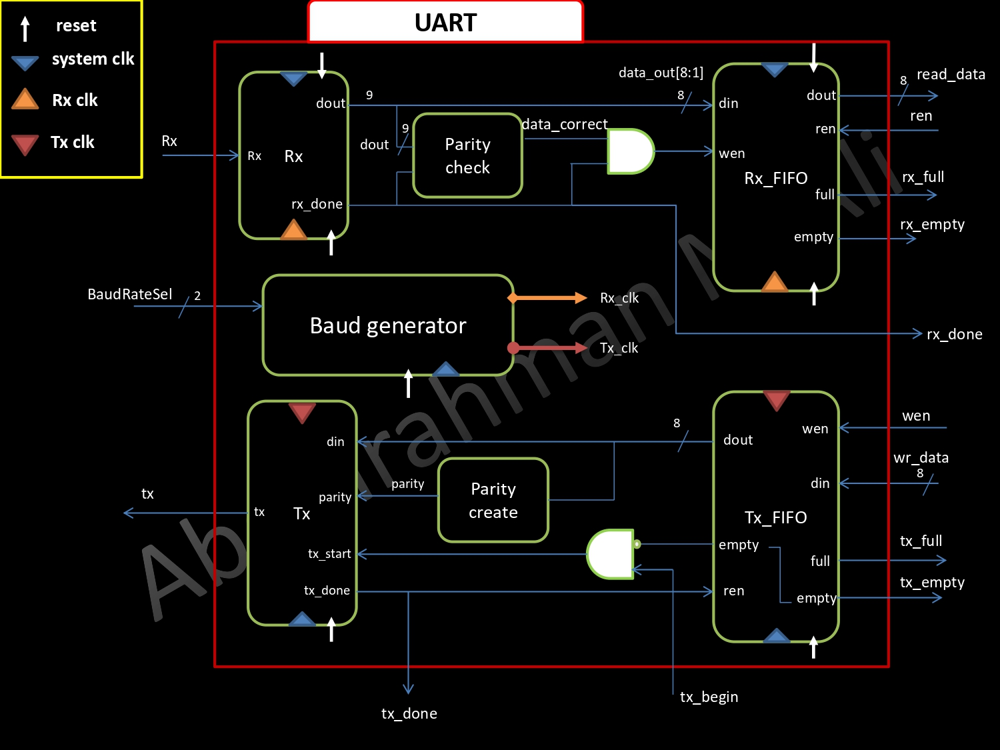

<p align="center">
  
</p>
<p align="center">
    <h1 align="center">UART-RTL</h1>
</p>
<p align="center">
    <em>Language have been used</em>
</p>
<p align="center">
	
	
<p>
<p align="center">
		<em>Developed with the software and tools below.</em>
</p>
<p align="center">
	
	
	
</p>
<hr>

##  Quick Links

> - [ Overview](#overview)
> - [ Design Architecture](#design-architecture)
> - [ Repository Structure](#repository-structure)
> - [ Modules](#modules)
> - [ Getting Started](#getting-started)
>   - [ Requirements](#requirements)
>   - [ Installation](#installation)
>   - [ Running UART-RTL](#running-uart-rtl)
> - [ Contributing](#contributing)
> - [ Contact info](#contact-info)

---

##  Overview

UART is a common serial communication protocol used in embedded systems, microcontrollers, and various other applications. It is an asynchronous protocol, where the transmitter and receiver do not share a common clock signal, but rely on predefined baud rates to synchronize the data transfer.

A UART data frame consists of a start bit, data bits, an optional parity bit, and one or more stop bits. The number of data bits can typically range from 5 to 8, in my implementation it's parametrized.

---

## Design Architecture



---

##  Repository Structure

```sh
└── UART-RTL/
    ├── Documents
    │   ├── Architecture.jpg
    │   └── UART Report.pdf
    ├── RTL
    │   ├── BaudGenerator
    │   │   ├── BaudRateGenerator.sv
    │   │   ├── RxBaudGenerator.sv
    │   │   └── TxBaudGenerator.sv
    │   ├── FIFO
    │   │   ├── FIFO.sv
    │   │   ├── FIFO_CO.sv
    │   │   └── register.sv
    │   ├── Rx
    │   │   ├── EvenParityCheck.sv
    │   │   ├── ReceiverSIPO.sv
    │   │   └── RxUnit.sv
    │   ├── Tx
    │   │   ├── EvenParityCreat.sv
    │   │   ├── TransmitterPISO.sv
    │   │   └── TxUnit.sv
    │   └── UART.sv
    ├── Rxfifo.dat
    ├── Txfifo.dat
    ├── run.tcl
    └── testbench
        └── uart_tb.sv
```

---

##  Modules
***RTL***
<details closed><summary>Top module</summary>

| File                                                                           | Summary                                 |
| ---                                                                            | ---                                     |
| [UART.sv](https://github.com/Abdelrahman1810/UART-RTL/blob/master/RTL/UART.sv) | Top module `RTL/UART.sv` |

</details>

<details closed><summary>BaudGenerator</summary>

| File                                                                                                                   | Summary                                                            |
| ---                                                                                                                    | ---                                                                |
| [TxBaudGenerator.sv](https://github.com/Abdelrahman1810/UART-RTL/blob/master/RTL/BaudGenerator/TxBaudGenerator.sv)     | `RTL/BaudGenerator/TxBaudGenerator.sv`   |
| [RxBaudGenerator.sv](https://github.com/Abdelrahman1810/UART-RTL/blob/master/RTL/BaudGenerator/RxBaudGenerator.sv)     | `RTL/BaudGenerator/RxBaudGenerator.sv`   |
| [BaudRateGenerator.sv](https://github.com/Abdelrahman1810/UART-RTL/blob/master/RTL/BaudGenerator/BaudRateGenerator.sv) | `RTL/BaudGenerator/BaudRateGenerator.sv` |

</details>

<details closed><summary>FIFO</summary>

| File                                                                                        | Summary                                          |
| ---                                                                                         | ---                                              |
| [FIFO.sv](https://github.com/Abdelrahman1810/UART-RTL/blob/master/RTL/FIFO/FIFO.sv)         | `RTL/FIFO/FIFO.sv`     |
| [register.sv](https://github.com/Abdelrahman1810/UART-RTL/blob/master/RTL/FIFO/register.sv) | `RTL/FIFO/register.sv` |
| [FIFO_CO.sv](https://github.com/Abdelrahman1810/UART-RTL/blob/master/RTL/FIFO/FIFO_CO.sv)   | `RTL/FIFO/FIFO_CO.sv`  |

</details>

<details closed><summary>Tx</summary>

| File                                                                                                    | Summary                                               |
| ---                                                                                                     | ---                                                   |
| [EvenParityCreat.sv](https://github.com/Abdelrahman1810/UART-RTL/blob/master/RTL/Tx/EvenParityCreat.sv) | `RTL/Tx/EvenParityCreat.sv` |
| [TransmitterPISO.sv](https://github.com/Abdelrahman1810/UART-RTL/blob/master/RTL/Tx/TransmitterPISO.sv) | Parallel in Series Out `RTL/Tx/TransmitterPISO.sv` |
| [TxUnit.sv](https://github.com/Abdelrahman1810/UART-RTL/blob/master/RTL/Tx/TxUnit.sv)                   | `RTL/Tx/TxUnit.sv`          |

</details>

<details closed><summary>Rx</summary>

| File                                                                                                    | Summary                                               |
| ---                                                                                                     | ---                                                   |
| [ReceiverSIPO.sv](https://github.com/Abdelrahman1810/UART-RTL/blob/master/RTL/Rx/ReceiverSIPO.sv)       | Series in Parallel Out `RTL/Rx/ReceiverSIPO.sv`    |
| [EvenParityCheck.sv](https://github.com/Abdelrahman1810/UART-RTL/blob/master/RTL/Rx/EvenParityCheck.sv) | `RTL/Rx/EvenParityCheck.sv` |
| [RxUnit.sv](https://github.com/Abdelrahman1810/UART-RTL/blob/master/RTL/Rx/RxUnit.sv)                   | `RTL/Rx/RxUnit.sv`          |

</details>

---
***testbench***
<details closed><summary>testbench</summary>

| File                                                                                       | Summary                                          |
| ---                                                                                        | ---                                              |
| [uart_tb.sv](https://github.com/Abdelrahman1810/UART-RTL/blob/master/testbench/uart_tb.sv) | `testbench/uart_tb.sv` |

</details>

---
***TCL***
<details closed><summary>TCL</summary>

| File                                                                       | Summary                             |
| ---                                                                        | ---                                 |
| [run.tcl](https://github.com/Abdelrahman1810/UART-RTL/blob/master/run.tcl) | `run.tcl` |

</details>

---

##  Getting Started

### Requirements
> [!IMPORTANT]
> Ensure you have the following dependencies installed on your system:
 
* **QuestaSim**: [download link](https://eda.sw.siemens.com/en-US/ic/questa/simulation/advanced-simulator/) 
* **Quartus**: [download link](https://www.intel.com/content/www/us/en/products/details/fpga/development-tools/quartus-prime/resource.html)
* **Any TesxtEditor (E.g VScode, sublime Text,..,etc)**: [VScode](https://code.visualstudio.com/Download), [sublime](https://www.sublimetext.com/download)

###  Installation

1. Clone the UART-RTL repository:

```sh
git clone https://github.com/Abdelrahman1810/UART-RTL
```

###  Running UART-RTL

1. Make new project in Questa 

    ```sh
    file -> new Project
    ```

2. add path where the repository in

3. run this comand in Questa transcript to simulate UART

   ```ruby
   do run.tcl
   ```
> [!NOTE]
> You can resimulate design with diffrent Baud rate from tcl file or testbench file `uart_tb.sv`


##  Contributing

If you find any issues or have suggestions for improvement, feel free to submit a pull request or open an issue in the repository. Contributions are always welcome!

<details closed>
    <summary>Contributing Guidelines</summary>

1. **Fork the Repository**: Start by forking the project repository to your GitHub account.
2. **Clone Locally**: Clone the forked repository to your local machine using a Git client.
   ```sh
   git clone https://github.com/Abdelrahman1810/UART-RTL
   ```
3. **Create a New Branch**: Always work on a new branch, giving it a descriptive name.
   ```sh
   git checkout -b new-feature-x
   ```
4. **Make Your Changes**: Develop and test your changes locally.
5. **Commit Your Changes**: Commit with a clear message describing your updates.
   ```sh
   git commit -m 'Implemented new feature x.'
   ```
6. **Push to GitHub**: Push the changes to your forked repository.
   ```sh
   git push origin new-feature-x
   ```
7. **Submit a Pull Request**: Create a PR against the original project repository. Clearly describe the changes and their motivations.

Once your PR is reviewed and approved, it will be merged into the main branch.

</details>

---

## Contact info

<a href="https://linktr.ee/A_Hassanen" target="_blank">
  
</a> 
<br>
<br>
<br>


[**Return**](#quick-links)

---
